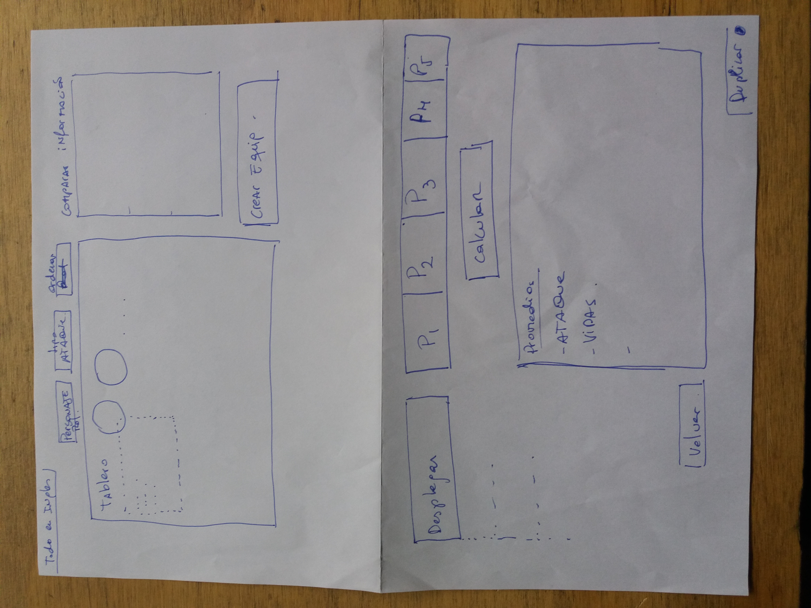
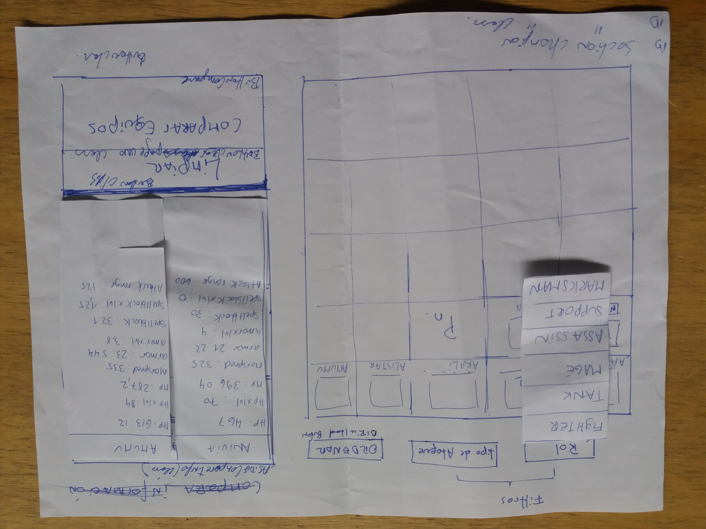
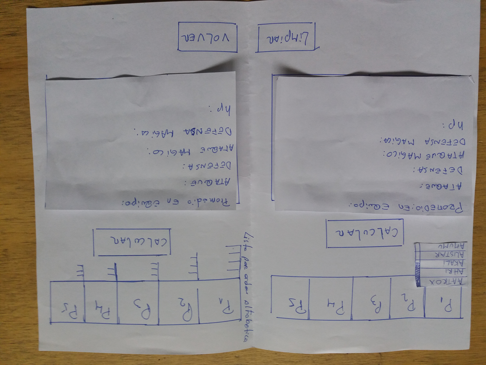

# **Data Lovers**

## **Índice**

* [Definición del producto](#definicion-del-producto)
* [Historias de usuario](#historias-de-usuario)
* [Diseño de la Interfaz de Usuario](#diseño-de-la-interfaz-de-usuario)

## **1 Definición del producto**

Para éste proyecto se desarrollo una aplicación ocupando la data del juego League of Legends con el objetivo de aprender a manipular objetos y arreglos. 

Al pensar en el usuario de nuestra app descubrimos que deberían ser jugadores principiantes e intermedios cuyo objetivo principal en relación a nuestro producto es por un lado investigar, visualizar y comparar estadísticas (stats) de los personajes del juego, denominados campeones (champions), para poder tomar desiciones respecto de personajes a elegir, por otro lado, poder generar estadísticas por equipo con el fin de seleccionar el equipo con mejores posibilidades de ganar.

El foco principal de interfaz esta orientado a la visualización de los campeones y sus estadísticas, el producto se espera que sea utizado en tiempos de ocio y juego.

<!-- Documenta brevemente tu trabajo en el archivo `README.md` de tu repositorio,
contándonos cómo fue tu proceso de diseño y cómo crees que el producto resuelve
el problema (o problemas) que tiene tu usuario. -->

## **2. Historias de usuario**

Se establecieron cuatro historias de usuario como eje principal de la aplicación, con vista a resolver las problematicas planteadas en la investigación de usuario.

[Desarrollo-historias-de-usuario](https://trello.com/b/COxp4S3I/data-lovers-lol)

## **3. Diseño de la Interfaz de Usuario**

### Prototipo de baja fidelidad

Primeras aproximaciones visuales de nuestra app.

 
 

<!-- Durante tu trabajo deberás haber hecho e iterado sketches (boceto) de tu
solución usando papel y lápiz. Te recomendamos tomar fotos de todas las
iteraciones que realices, y las subas a tu repositorio, y las menciones en tu
`README.md`.
 -->
### Prototipo de alta fidelidad

[Prototipo](https://www.figma.com/proto/RRdDYyEtp87n5HkxMwCcYAMD/LOL-Data-Lovers?node-id=0%3A1&scaling=min-zoom)

 

 

